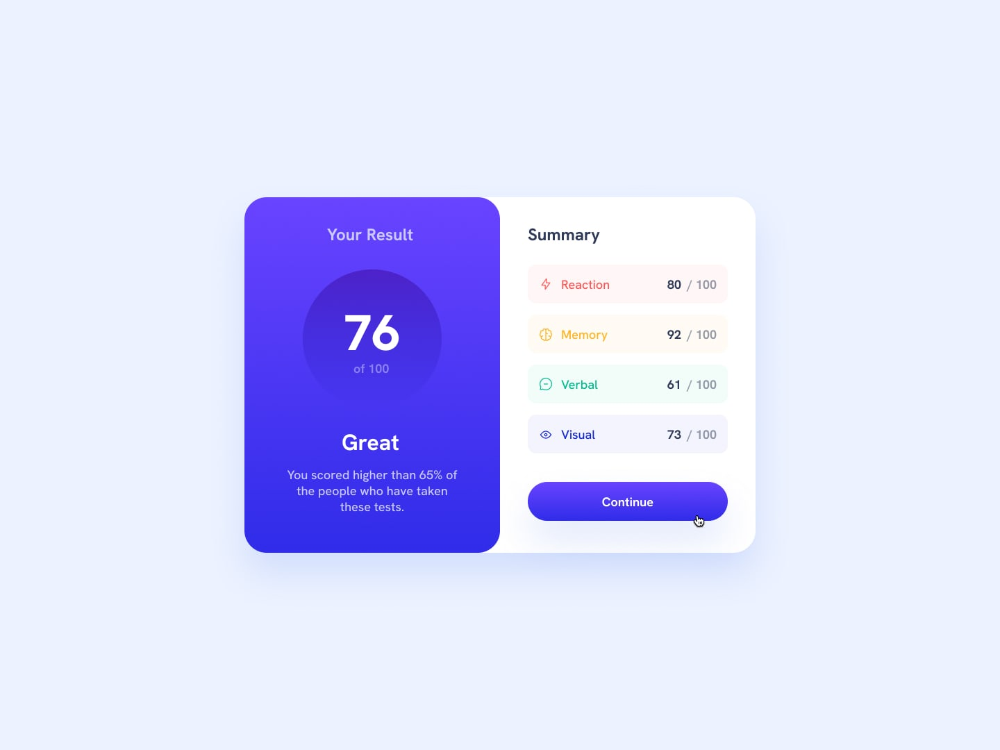

# Results Summary Component

A responsive results summary component built with HTML and CSS. Features gradient backgrounds, interactive elements, and mobile-first design principles.

## 📌 Features

- Responsive design that works on mobile and desktop
- Interactive button with hover effects
- Clean, modern UI with gradient backgrounds
- Semantic HTML structure
- CSS custom properties for easy theming
- Mobile-first approach with media queries

## 🚀 Technologies Used

- HTML5
- CSS3 (Flexbox, custom properties, gradients)
- SVG icons

## 📷 Screenshots

### Desktop View

### Mobile View

---

## Installation

No installation required - just clone the repository and open `index.html` in your browser.

## How to Use

1. Clone this repository
2. Open `index.html` in your browser
3. Hover over the button to see the interactive effects

## Customization

To customize this result summary :

1. Edit the `index.html` to change the content
2. Modify the colors in the `:root` selector in `style.css`
3. Replace this summary with your own summary

## License

This project is licensed under the MIT License - see the [LICENSE](LICENSE) file for details.

## 📬 Contact

- GitHub: https://github.com/MahmoudAli-95/results-summary-component.git
